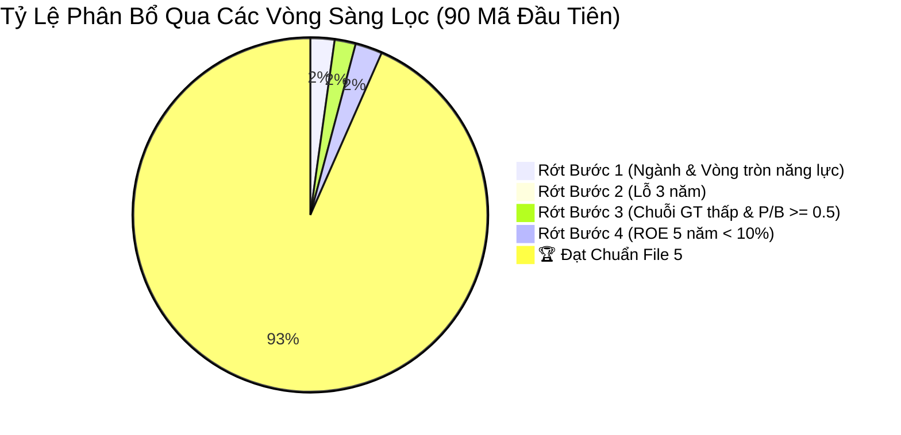

# 📊 Bảng Điều Khiển Sàng Lọc Doanh Nghiệp (Screening Dashboard)

Tài liệu này theo dõi toàn bộ trạng thái của các mã cổ phiếu trong vũ trụ đầu tư đã được đưa qua phễu lọc 4 bước.

---

## 1. Thống Kê Phễu Lọc (Funnel Metrics)

- **Tổng số mã đã kiểm tra:** **90** doanh nghiệp
- **Số mã rớt tại Bước 1:** **16** mã (17.8%)
- **Số mã rớt tại Bước 2:** **1** mã (1.1%)
- **Số mã rớt tại Bước 3:** **14** mã (15.6%)
- **Số mã rớt tại Bước 4:** **18** mã (20.0%)
- **Số mã đạt chuẩn vào File 5:** **41** mã (45.6%)

---

## ⚡ Hệ Thống Các Bảng Tóm Tắt Nhanh (Quick Summary Tables)

Để tiện cho việc theo dõi và **lướt qua nhanh** mà không phải cuộn qua các bài phân tích dài dòng, hệ thống đã tách riêng các file bảng tóm tắt:

| STT | File Bảng Tóm Tắt Rút Gọn | Nội Dung Trọng Tâm | Số Lượng Mã | Bản Phân Tích Đầy Đủ |
| :---: | :--- | :--- | :---: | :--- |
| ⚡ | [00-quick-summary-all.md](file:///Users/nhan/Personal/code/pdf-analyzer/screenings/00-quick-summary-all.md) | **Bảng Tổng Hợp Siêu Tốc 50 Cổ Phiếu** (Cheat-sheet 1 trang) | 90 mã | Xem chi tiết từng mã |
| 1 | [summary-01-circle-of-competence.md](file:///Users/nhan/Personal/code/pdf-analyzer/screenings/summary-01-circle-of-competence.md) | Bảng tóm tắt các công ty rớt Bước 1 (Ngành nghề ngoài VTNL) | 16 mã | [01-rejected-circle-of-competence.md](file:///Users/nhan/Personal/code/pdf-analyzer/screenings/01-rejected-circle-of-competence.md) |
| 2 | [summary-02-consecutive-loss.md](file:///Users/nhan/Personal/code/pdf-analyzer/screenings/summary-02-consecutive-loss.md) | Bảng tóm tắt các công ty rớt Bước 2 (Lỗ 3 năm liên tiếp) | 1 mã | [02-rejected-consecutive-loss.md](file:///Users/nhan/Personal/code/pdf-analyzer/screenings/02-rejected-consecutive-loss.md) |
| 3 | [summary-03-low-value-chain.md](file:///Users/nhan/Personal/code/pdf-analyzer/screenings/summary-03-low-value-chain.md) | Bảng tóm tắt các công ty rớt Bước 3 (Chuỗi GT thấp & P/B >= 0.5) | 14 mã | [03-rejected-low-value-chain.md](file:///Users/nhan/Personal/code/pdf-analyzer/screenings/03-rejected-low-value-chain.md) |
| 4 | [summary-04-low-roe.md](file:///Users/nhan/Personal/code/pdf-analyzer/screenings/summary-04-low-roe.md) | Bảng tóm tắt các công ty rớt Bước 4 (ROE 5 năm < 10%) | 18 mã | [04-rejected-low-roe.md](file:///Users/nhan/Personal/code/pdf-analyzer/screenings/04-rejected-low-roe.md) |
| 5 | [summary-05-passed-champions.md](file:///Users/nhan/Personal/code/pdf-analyzer/screenings/summary-05-passed-champions.md) | 🏆 **Bảng tóm tắt 22 Doanh Nghiệp Đạt Chuẩn (File 5)** | 41 mã | [05-passed-champions.md](file:///Users/nhan/Personal/code/pdf-analyzer/screenings/05-passed-champions.md) |

---

## 2. Bảng Theo Dõi Chi Tiết Toàn Bộ Cổ Phiếu

| STT | Mã CK | Tên Doanh Nghiệp | Ngành Hoạt Động | B1: Ngành | B2: Lãi 3N | B3: Chuỗi GT & P/B | B4: ROE 5N | Trạng Thái Chung Cuộc | File Lưu Trữ |
| :---: | :---: | :--- | :--- | :---: | :---: | :---: | :---: | :--- | :--- |
| 1 | **AAA** | CTCP Nhựa An Phát Xanh | Bao bì nhựa & hạt nhựa | ✅ Pass | ✅ Pass | ⚠️ Pass (P/B=0.45 < 0.5) | ❌ Loại (ROE ~4.8% < 10%) | Dừng ở Bước 4 | [04-rejected-low-roe.md](file:///Users/nhan/Personal/code/pdf-analyzer/screenings/04-rejected-low-roe.md) |
| 2 | **AAM** | CTCP Thủy sản Mekong | Chế biến cá tra đông lạnh | ✅ Pass | ✅ Pass | ⚠️ Pass (P/B=0.39 < 0.5) | ❌ Loại (ROE < 1.2% < 10%) | Dừng ở Bước 4 | [04-rejected-low-roe.md](file:///Users/nhan/Personal/code/pdf-analyzer/screenings/04-rejected-low-roe.md) |
| 3 | **AAN** | CTCP Lương thực A An | Bán buôn lúa gạo | ✅ Pass | ✅ Pass | ❌ Loại (Biên mỏng 1.3%, P/B 1.2 >= 0.5) | - | Dừng ở Bước 3 | [03-rejected-low-value-chain.md](file:///Users/nhan/Personal/code/pdf-analyzer/screenings/03-rejected-low-value-chain.md) |
| 4 | **AAT** | CTCP Tập đoàn Tiên Sơn Thanh Hóa | Gia công may mặc | ✅ Pass | ✅ Pass | ⚠️ Pass (P/B=0.20 < 0.5) | ❌ Loại (ROE ~3.1% < 10%) | Dừng ở Bước 4 | [04-rejected-low-roe.md](file:///Users/nhan/Personal/code/pdf-analyzer/screenings/04-rejected-low-roe.md) |
| 5 | **ABR** | CTCP Đầu tư Nhãn hiệu Việt | Thương mại bán lẻ | ✅ Pass | ✅ Pass | ❌ Loại (Biên mỏng, P/B 1.0 >= 0.5) | - | Dừng ở Bước 3 | [03-rejected-low-value-chain.md](file:///Users/nhan/Personal/code/pdf-analyzer/screenings/03-rejected-low-value-chain.md) |
| 6 | **ABS** | CTCP Dịch vụ Nông nghiệp Bình Thuận | Phân phối phân bón | ✅ Pass | ❌ Loại (Lỗ lớn, kiểm soát) | - | - | Dừng ở Bước 2 | [02-rejected-consecutive-loss.md](file:///Users/nhan/Personal/code/pdf-analyzer/screenings/02-rejected-consecutive-loss.md) |
| 7 | **ABT** | CTCP Xuất nhập khẩu Thủy sản Bến Tre | Thủy sản nghêu MSC | ✅ Pass | ✅ Pass | ✅ Pass (Nghêu MSC biên gộp 28%) | ✅ Pass (ROE 23.5%) | 🏆 **Lọt vào File 5** | [05-passed-champions.md](file:///Users/nhan/Personal/code/pdf-analyzer/screenings/05-passed-champions.md) |
| 8 | **ACB** | Ngân hàng TMCP Á Châu | Ngân hàng bán lẻ tư nhân | ✅ Pass | ✅ Pass | ✅ Pass (CASA cao, nợ xấu thấp) | ✅ Pass (ROE 24.5%) | 🏆 **Lọt vào File 5** | [05-passed-champions.md](file:///Users/nhan/Personal/code/pdf-analyzer/screenings/05-passed-champions.md) |
| 9 | **ACC** | CTCP Đầu tư và Xây dựng Bình Dương | Xây dựng & bê tông | ❌ Loại (Xây lắp & VLXD đại trà) | - | - | - | Dừng ở Bước 1 | [01-rejected-circle-of-competence.md](file:///Users/nhan/Personal/code/pdf-analyzer/screenings/01-rejected-circle-of-competence.md) |
| 10 | **ACG** | CTCP Gỗ An Cường | Ván gỗ nội thất cao cấp | ✅ Pass | ✅ Pass | ✅ Pass (Thị phần >50%, biên 30%) | ✅ Pass (ROE 11.4%) | 🏆 **Lọt vào File 5** | [05-passed-champions.md](file:///Users/nhan/Personal/code/pdf-analyzer/screenings/05-passed-champions.md) |
| 11 | **ACL** | CTCP XNK Thủy sản Cửu Long An Giang | Cá tra sơ chế thô | ✅ Pass | ✅ Pass | ❌ Loại (Cá tra thô, P/B 0.72 >= 0.5) | - | Dừng ở Bước 3 | [03-rejected-low-value-chain.md](file:///Users/nhan/Personal/code/pdf-analyzer/screenings/03-rejected-low-value-chain.md) |
| 12 | **ADG** | CTCP Clever Group | Digital Marketing | ✅ Pass | ✅ Pass | ⚠️ Pass (P/B=0.42 < 0.5) | ✅ Pass (ROE 2022: 12.2%) | 🏆 **Lọt vào File 5** | [05-passed-champions.md](file:///Users/nhan/Personal/code/pdf-analyzer/screenings/05-passed-champions.md) |
| 13 | **ADP** | CTCP Sơn Á Đông | Sơn cuộn công nghiệp tôn mạ | ✅ Pass | ✅ Pass | ✅ Pass (Độc tôn sơn cuộn, biên 25%) | ✅ Pass (ROE 26.1%) | 🏆 **Lọt vào File 5** | [05-passed-champions.md](file:///Users/nhan/Personal/code/pdf-analyzer/screenings/05-passed-champions.md) |
| 14 | **ADS** | CTCP Damsan | Sợi dệt cotton & khăn bông | ✅ Pass | ✅ Pass | ❌ Loại (Gia công, P/B 0.57 >= 0.5) | - | Dừng ở Bước 3 | [03-rejected-low-value-chain.md](file:///Users/nhan/Personal/code/pdf-analyzer/screenings/03-rejected-low-value-chain.md) |
| 15 | **AFX** | CTCP XNK Nông sản Thực phẩm An Giang | Gạo thô & thức ăn chăn nuôi | ✅ Pass | ✅ Pass | ❌ Loại (Gạo thô, P/B 0.65 >= 0.5) | - | Dừng ở Bước 3 | [03-rejected-low-value-chain.md](file:///Users/nhan/Personal/code/pdf-analyzer/screenings/03-rejected-low-value-chain.md) |
| 16 | **AGG** | CTCP Đầu tư BĐS An Gia | BĐS nhà ở dân dụng | ❌ Loại (BĐS dân dụng đại trà) | - | - | - | Dừng ở Bước 1 | [01-rejected-circle-of-competence.md](file:///Users/nhan/Personal/code/pdf-analyzer/screenings/01-rejected-circle-of-competence.md) |
| 17 | **AGR** | CTCP Chứng khoán Agribank | Chứng khoán (Agribank) | ✅ Pass | ✅ Pass | ✅ Pass (Hệ sinh thái Agribank) | ✅ Pass (ROE 2021: 17.2%) | 🏆 **Lọt vào File 5** | [05-passed-champions.md](file:///Users/nhan/Personal/code/pdf-analyzer/screenings/05-passed-champions.md) |
| 18 | **ANT** | CTCP Rau quả Thực phẩm An Giang | Chế biến rau quả IQF | ✅ Pass | ✅ Pass | ✅ Pass (Chế biến sâu IQF xuất khẩu) | ✅ Pass (ROE > 20%) | 🏆 **Lọt vào File 5** | [05-passed-champions.md](file:///Users/nhan/Personal/code/pdf-analyzer/screenings/05-passed-champions.md) |
| 19 | **ANV** | CTCP Nam Việt (Navico) | Cá tra xuất khẩu | ✅ Pass | ✅ Pass | ❌ Loại (Cá tra thô, P/B 0.73 >= 0.5) | - | Dừng ở Bước 3 | [03-rejected-low-value-chain.md](file:///Users/nhan/Personal/code/pdf-analyzer/screenings/03-rejected-low-value-chain.md) |
| 20 | **APG** | CTCP Chứng khoán APG | Dịch vụ chứng khoán | ✅ Pass | ✅ Pass | ⚠️ Pass (P/B=0.45 < 0.5) | ❌ Loại (ROE ~0.3% - 1.5% < 10%) | Dừng ở Bước 4 | [04-rejected-low-roe.md](file:///Users/nhan/Personal/code/pdf-analyzer/screenings/04-rejected-low-roe.md) |
| 21 | **APH** | CTCP Tập đoàn An Phát Holdings | Gia công bao bì & hạt nhựa | ✅ Pass | ✅ Pass | ❌ Loại (Bao bì gia công, P/B 0.62 >= 0.5) | - | Dừng ở Bước 3 | [03-rejected-low-value-chain.md](file:///Users/nhan/Personal/code/pdf-analyzer/screenings/03-rejected-low-value-chain.md) |
| 22 | **ASG** | CTCP Tập đoàn ASG | Kho bãi hậu cần hàng không | ✅ Pass | ✅ Pass | ✅ Pass (Logistics hàng không) | ❌ Loại (ROE 5 năm chỉ ~3.7% < 10%) | Dừng ở Bước 4 | [04-rejected-low-roe.md](file:///Users/nhan/Personal/code/pdf-analyzer/screenings/04-rejected-low-roe.md) |
| 23 | **ASM** | CTCP Tập đoàn Sao Mai | BĐS dân dụng & Xây dựng | ❌ Loại (BĐS dân dụng & xây lắp) | - | - | - | Dừng ở Bước 1 | [01-rejected-circle-of-competence.md](file:///Users/nhan/Personal/code/pdf-analyzer/screenings/01-rejected-circle-of-competence.md) |
| 24 | **ASP** | CTCP Tập đoàn Dầu khí An Pha | Phân phối khí gas LPG | ✅ Pass | ✅ Pass | ❌ Loại (Phân phối gas đại trà, P/B 1.74 >= 0.5) | - | Dừng ở Bước 3 | [03-rejected-low-value-chain.md](file:///Users/nhan/Personal/code/pdf-analyzer/screenings/03-rejected-low-value-chain.md) |
| 25 | **AST** | CTCP Dịch vụ Hàng không Taseco | Dịch vụ phi hàng không sân bay | ✅ Pass | ✅ Pass | ✅ Pass (Độc quyền bán lẻ sân bay, biên gộp 50-60%) | ✅ Pass (ROE 24.0%) | 🏆 **Lọt vào File 5** | [05-passed-champions.md](file:///Users/nhan/Personal/code/pdf-analyzer/screenings/05-passed-champions.md) |
| 26 | **BAF** | CTCP Nông nghiệp BaF Việt Nam | Chăn nuôi heo & buôn nông sản | ✅ Pass | ✅ Pass | ❌ Loại (Buôn nông sản thô >70%, P/B 3.34 >= 0.5) | - | Dừng ở Bước 3 | [03-rejected-low-value-chain.md](file:///Users/nhan/Personal/code/pdf-analyzer/screenings/03-rejected-low-value-chain.md) |
| 27 | **BBC** | CTCP Bibica | Bánh kẹo & thực phẩm | ✅ Pass | ✅ Pass | ✅ Pass (Thương hiệu bánh kẹo lớn) | ❌ Loại (ROE 5 năm chỉ 2.3% - 8.8% < 10%) | Dừng ở Bước 4 | [04-rejected-low-roe.md](file:///Users/nhan/Personal/code/pdf-analyzer/screenings/04-rejected-low-roe.md) |
| 28 | **BCE** | CTCP Xây dựng Giao thông Bình Dương | Xây lắp hạ tầng giao thông | ❌ Loại (Xây lắp hạ tầng thông thường) | - | - | - | Dừng ở Bước 1 | [01-rejected-circle-of-competence.md](file:///Users/nhan/Personal/code/pdf-analyzer/screenings/01-rejected-circle-of-competence.md) |
| 29 | **BCM** | Tổng Công ty Becamex IDC | BĐS Khu công nghiệp đặc thù | ⚠️ Pass (BĐS KCN quỹ đất sạch khổng lồ) | ✅ Pass | ✅ Pass (Thương hiệu VSIP, biên gộp KCN 50%) | ✅ Pass (ROE 10.6% - 16.5%) | 🏆 **Lọt vào File 5** | [05-passed-champions.md](file:///Users/nhan/Personal/code/pdf-analyzer/screenings/05-passed-champions.md) |
| 30 | **BFC** | CTCP Phân bón Bình Điền | Phân bón NPK Đầu Trâu | ✅ Pass | ✅ Pass | ✅ Pass (Thương hiệu số 1 VN, biên 18%) | ✅ Pass (ROE 5N đều >10%, 2024: 23.5%) | 🏆 **Lọt vào File 5** | [05-passed-champions.md](file:///Users/nhan/Personal/code/pdf-analyzer/screenings/05-passed-champions.md) |
| 31 | **BHN** | Tổng CTCP Bia - Rượu - NGK Hà Nội | Bia Hà Nội, Bia Trúc Bạch | ✅ Pass | ✅ Pass | ✅ Pass (Bia Hà Nội thương hiệu lớn) | ❌ Loại (ROE 4 năm gần nhất chỉ 6% - 7%) | Dừng ở Bước 4 | [04-rejected-low-roe.md](file:///Users/nhan/Personal/code/pdf-analyzer/screenings/04-rejected-low-roe.md) |
| 32 | **BIC** | Tổng CTCP Bảo hiểm BIDV | Bảo hiểm phi nhân thọ | ✅ Pass | ✅ Pass | ✅ Pass (Bancassurance độc quyền BIDV) | ✅ Pass (ROE 15% - 16.7%) | 🏆 **Lọt vào File 5** | [05-passed-champions.md](file:///Users/nhan/Personal/code/pdf-analyzer/screenings/05-passed-champions.md) |
| 33 | **BID** | Ngân hàng TMCP Đầu tư và Phát triển VN | Ngân hàng quốc doanh số 1 | ✅ Pass | ✅ Pass | ✅ Pass (Thị phần số 1, chi phí vốn rẻ) | ✅ Pass (ROE 16% - 18%) | 🏆 **Lọt vào File 5** | [05-passed-champions.md](file:///Users/nhan/Personal/code/pdf-analyzer/screenings/05-passed-champions.md) |
| 34 | **BKG** | CTCP Đầu tư BKG Việt Nam | Đồ gỗ nội thất & viên nén | ✅ Pass | ✅ Pass | ⚠️ Pass (P/B=0.18 < 0.5) | ❌ Loại (ROE 5 năm chỉ 1.2% - 5.8% < 10%) | Dừng ở Bước 4 | [04-rejected-low-roe.md](file:///Users/nhan/Personal/code/pdf-analyzer/screenings/04-rejected-low-roe.md) |
| 35 | **BMC** | CTCP Khoáng sản Bình Định | Khai thác & luyện xỉ Titan | ⚠️ Pass (Mỏ Titan độc quyền) | ✅ Pass | ✅ Pass (Xỉ titan xuất khẩu, biên gộp 30%) | ✅ Pass (ROE 10.6% - 10.8%) | 🏆 **Lọt vào File 5** | [05-passed-champions.md](file:///Users/nhan/Personal/code/pdf-analyzer/screenings/05-passed-champions.md) |
| 36 | **BMI** | Tổng CTCP Bảo hiểm Bảo Minh | Bảo hiểm phi nhân thọ | ✅ Pass | ✅ Pass | ✅ Pass (Mạng lưới toàn quốc, cổ đông AXA) | ✅ Pass (ROE 10.5% - 12.5%) | 🏆 **Lọt vào File 5** | [05-passed-champions.md](file:///Users/nhan/Personal/code/pdf-analyzer/screenings/05-passed-champions.md) |
| 37 | **BMP** | CTCP Nhựa Bình Minh | Ống nhựa xây dựng số 1 VN | ✅ Pass | ✅ Pass | ✅ Pass (Độc tôn >50% thị phần, biên 40%) | ✅ Pass (ROE đỉnh cao 36% - 38%) | 🏆 **Lọt vào File 5** | [05-passed-champions.md](file:///Users/nhan/Personal/code/pdf-analyzer/screenings/05-passed-champions.md) |
| 38 | **BRC** | CTCP Cao su Bến Thành | Băng tải cao su kỹ thuật | ✅ Pass | ✅ Pass | ✅ Pass (Băng tải kỹ thuật cao nhiệt điện/xi măng) | ✅ Pass (ROE ổn định ~10.2%) | 🏆 **Lọt vào File 5** | [05-passed-champions.md](file:///Users/nhan/Personal/code/pdf-analyzer/screenings/05-passed-champions.md) |
| 39 | **BSI** | CTCP Chứng khoán BIDV (BSC) | Dịch vụ chứng khoán | ✅ Pass | ✅ Pass | ✅ Pass (Hệ sinh thái BIDV & Hana Hàn Quốc) | ✅ Pass (ROE 14.6%) | 🏆 **Lọt vào File 5** | [05-passed-champions.md](file:///Users/nhan/Personal/code/pdf-analyzer/screenings/05-passed-champions.md) |
| 40 | **BSR** | CTCP Lọc hóa dầu Bình Sơn | Lọc hóa dầu Dung Quất | ✅ Pass | ✅ Pass | ✅ Pass (Lọc dầu Dung Quất cung cấp 30% xăng dầu) | ✅ Pass (ROE đỉnh cao 15% - 36.5%) | 🏆 **Lọt vào File 5** | [05-passed-champions.md](file:///Users/nhan/Personal/code/pdf-analyzer/screenings/05-passed-champions.md) |
| 41 | **BTP** | CTCP Nhiệt điện Bà Rịa | Phát điện nhiệt điện khí | ✅ Pass | ✅ Pass | ⚠️ Pass (P/B=0.41 < 0.5) | ❌ Loại (ROE 5 năm chỉ ~5.8% < 10%) | Dừng ở Bước 4 | [04-rejected-low-roe.md](file:///Users/nhan/Personal/code/pdf-analyzer/screenings/04-rejected-low-roe.md) |
| 42 | **BTT** | CTCP Thương mại - Dịch vụ Bến Thành | Quản lý TTTM & cho thuê BĐS Quận 1 | ✅ Pass | ✅ Pass | ✅ Pass (Mặt bằng vàng Q.1, chợ Dân Sinh) | ✅ Pass (ROE 12.0% - 12.8%) | 🏆 **Lọt vào File 5** | [05-passed-champions.md](file:///Users/nhan/Personal/code/pdf-analyzer/screenings/05-passed-champions.md) |
| 43 | **BVB** | Ngân hàng TMCP Bản Việt (BVBank) | Ngân hàng bán lẻ quy mô nhỏ | ✅ Pass | ✅ Pass | ✅ Pass (Dịch vụ tài chính) | ❌ Loại (ROE 5 năm chỉ 1% - 7.3% < 10%) | Dừng ở Bước 4 | [04-rejected-low-roe.md](file:///Users/nhan/Personal/code/pdf-analyzer/screenings/04-rejected-low-roe.md) |
| 44 | **BVH** | Tập đoàn Bảo Việt | Bảo hiểm nhân thọ & phi nhân thọ | ✅ Pass | ✅ Pass | ✅ Pass (Bảo hiểm quốc gia số 1 VN) | ❌ Loại (ROE 5 năm chỉ 7.5% - 9.0% < 10%) | Dừng ở Bước 4 | [04-rejected-low-roe.md](file:///Users/nhan/Personal/code/pdf-analyzer/screenings/04-rejected-low-roe.md) |
| 45 | **BWE** | CTCP Nước - Môi trường Bình Dương | Độc quyền cấp nước Bình Dương | ✅ Pass | ✅ Pass | ✅ Pass (Độc quyền cấp nước thủ phủ KCN) | ✅ Pass (ROE 11.6% - 19.1%) | 🏆 **Lọt vào File 5** | [05-passed-champions.md](file:///Users/nhan/Personal/code/pdf-analyzer/screenings/05-passed-champions.md) |
| 46 | **C32** | CTCP CIC39 | Khai thác mỏ đá Tân Mỹ & cống bê tông | ⚠️ Pass (Mỏ đá Tân Mỹ đặc thù) | ✅ Pass | ⚠️ Pass (P/B=0.47 < 0.5 & Mỏ đá) | ✅ Pass (ROE 2020-2021: 13% - 15%) | 🏆 **Lọt vào File 5** | [05-passed-champions.md](file:///Users/nhan/Personal/code/pdf-analyzer/screenings/05-passed-champions.md) |
| 47 | **C47** | CTCP Xây dựng 47 | Xây lắp thủy lợi & thủy điện | ❌ Loại (Xây lắp hạ tầng thông thường) | - | - | - | Dừng ở Bước 1 | [01-rejected-circle-of-competence.md](file:///Users/nhan/Personal/code/pdf-analyzer/screenings/01-rejected-circle-of-competence.md) |
| 48 | **CCC** | CTCP Xây dựng CDC | Xây dựng dân dụng & công nghiệp | ❌ Loại (Nhà thầu xây dựng thông thường) | - | - | - | Dừng ở Bước 1 | [01-rejected-circle-of-competence.md](file:///Users/nhan/Personal/code/pdf-analyzer/screenings/01-rejected-circle-of-competence.md) |
| 49 | **CCI** | CTCP Đầu tư Phát triển CN-TM Củ Chi | BĐS KCN Tây Bắc Củ Chi | ⚠️ Pass (BĐS KCN quỹ đất sạch cho thuê) | ✅ Pass | ✅ Pass (KCN Tây Bắc Củ Chi, biên gộp cao) | ✅ Pass (ROE > 11% liên tục) | 🏆 **Lọt vào File 5** | [05-passed-champions.md](file:///Users/nhan/Personal/code/pdf-analyzer/screenings/05-passed-champions.md) |
| 50 | **CCL** | CTCP ĐT&PT Đô thị Dầu khí Cửu Long | BĐS nhà ở dân dụng (Mekong Centre) | ❌ Loại (BĐS nhà ở dân dụng tỉnh lẻ) | - | - | - | Dừng ở Bước 1 | [01-rejected-circle-of-competence.md](file:///Users/nhan/Personal/code/pdf-analyzer/screenings/01-rejected-circle-of-competence.md) |
| 51 | **CDC** | CTCP Chương Dương | Thi công xây lắp & BĐS nhà ở | ❌ Loại (Xây dựng & BĐS nhà ở dân dụng) | - | - | - | Dừng ở Bước 1 | [01-rejected-circle-of-competence.md](file:///Users/nhan/Personal/code/pdf-analyzer/screenings/01-rejected-circle-of-competence.md) |
| 52 | **CHP** | CTCP Thủy điện miền Trung | Năng lượng tái tạo (Thủy điện A Lưới) | ✅ Pass | ✅ Pass | ✅ Pass (Thủy điện A Lưới biên gộp 50-60%) | ✅ Pass (ROE 13% - 17%) | 🏆 **Lọt vào File 5** | [05-passed-champions.md](file:///Users/nhan/Personal/code/pdf-analyzer/screenings/05-passed-champions.md) |
| 53 | **CIG** | CTCP COMA18 | Xây lắp & hạ tầng xây dựng | ❌ Loại (Nhà thầu xây dựng thông thường) | - | - | - | Dừng ở Bước 1 | [01-rejected-circle-of-competence.md](file:///Users/nhan/Personal/code/pdf-analyzer/screenings/01-rejected-circle-of-competence.md) |
| 54 | **CII** | CTCP ĐT Hạ tầng Kỹ thuật TP.HCM | BĐS Thủ Thiêm & Xây dựng hạ tầng BOT | ❌ Loại (BĐS Thủ Thiêm & BOT đòn bẩy nợ >20k tỷ) | - | - | - | Dừng ở Bước 1 | [01-rejected-circle-of-competence.md](file:///Users/nhan/Personal/code/pdf-analyzer/screenings/01-rejected-circle-of-competence.md) |
| 55 | **CKG** | CTCP Tập đoàn CIC (CIC Group) | BĐS nhà ở dân dụng Kiên Giang | ❌ Loại (BĐS nhà ở dân dụng tỉnh lẻ) | - | - | - | Dừng ở Bước 1 | [01-rejected-circle-of-competence.md](file:///Users/nhan/Personal/code/pdf-analyzer/screenings/01-rejected-circle-of-competence.md) |
| 56 | **CLC** | CTCP Cát Lợi | Phụ liệu thuốc lá (Vinataba) | ✅ Pass | ✅ Pass | ✅ Pass (Độc quyền chi phối >70% đầu lọc thuốc lá) | ✅ Pass (ROE 16% - 17.5% suốt 5 năm) | 🏆 **Lọt vào File 5** | [05-passed-champions.md](file:///Users/nhan/Personal/code/pdf-analyzer/screenings/05-passed-champions.md) |
| 57 | **CLL** | CTCP Cảng Cát Lái | Dịch vụ cảng biển container | ✅ Pass | ✅ Pass | ✅ Pass (Cụm cảng Cát Lái số 1 VN, biên gộp 35-40%) | ✅ Pass (ROE 13.3% - 15.6%) | 🏆 **Lọt vào File 5** | [05-passed-champions.md](file:///Users/nhan/Personal/code/pdf-analyzer/screenings/05-passed-champions.md) |
| 58 | **CLW** | CTCP Cấp nước Chợ Lớn | Tiện ích cấp nước sạch đô thị | ✅ Pass | ✅ Pass | ✅ Pass (Độc quyền cấp nước Q.5, 6, 8, Bình Tân) | ✅ Pass (ROE bứt phá >21%) | 🏆 **Lọt vào File 5** | [05-passed-champions.md](file:///Users/nhan/Personal/code/pdf-analyzer/screenings/05-passed-champions.md) |
| 59 | **CMG** | CTCP Tập đoàn Công nghệ CMC | CNTT & Data Center Tân Thuận | ✅ Pass | ✅ Pass | ✅ Pass (Tập đoàn CNTT số 2 VN, đối tác Samsung SDS) | ✅ Pass (ROE đạt 10.06%) | 🏆 **Lọt vào File 5** | [05-passed-champions.md](file:///Users/nhan/Personal/code/pdf-analyzer/screenings/05-passed-champions.md) |
| 60 | **CMV** | CTCP Thương nghiệp Cà Mau | Phân phối xăng dầu Petrolimex Cà Mau | ✅ Pass | ✅ Pass | ❌ Loại (Phân phối biên ròng <0.5%, P/B 0.68 >= 0.5) | - | Dừng ở Bước 3 | [03-rejected-low-value-chain.md](file:///Users/nhan/Personal/code/pdf-analyzer/screenings/03-rejected-low-value-chain.md) |
| 61 | **CMX** | CTCP Camimex Group | Chế biến tôm sinh thái xuất khẩu | ✅ Pass | ✅ Pass | ⚠️ Pass (P/B=0.39 < 0.5) | ❌ Loại (ROE 5 năm chỉ 3.3% - 8.4% < 10%) | Dừng ở Bước 4 | [04-rejected-low-roe.md](file:///Users/nhan/Personal/code/pdf-analyzer/screenings/04-rejected-low-roe.md) |
| 62 | **CNG** | CTCP CNG Việt Nam | Khí nén thiên nhiên CNG & LNG | ✅ Pass | ✅ Pass | ✅ Pass (Thống trị >70% thị phần khí CNG) | ✅ Pass (ROE 14% - 18% suốt 5 năm) | 🏆 **Lọt vào File 5** | [05-passed-champions.md](file:///Users/nhan/Personal/code/pdf-analyzer/screenings/05-passed-champions.md) |
| 63 | **COM** | CTCP Vật tư - Xăng dầu (COMECO) | Bán lẻ xăng dầu qua cây xăng | ✅ Pass | ✅ Pass | ❌ Loại (Phân phối xăng dầu biên ròng ~1.5%, P/B 0.81 >= 0.5) | - | Dừng ở Bước 3 | [03-rejected-low-value-chain.md](file:///Users/nhan/Personal/code/pdf-analyzer/screenings/03-rejected-low-value-chain.md) |
| 64 | **CRC** | CTCP Create Capital Việt Nam | Pin năng lượng mặt trời & VLXD | ✅ Pass | ✅ Pass | ⚠️ Pass (P/B=0.41 < 0.5) | ❌ Loại (ROE 5 năm chỉ 2.7% - 7.8% < 10%) | Dừng ở Bước 4 | [04-rejected-low-roe.md](file:///Users/nhan/Personal/code/pdf-analyzer/screenings/04-rejected-low-roe.md) |
| 65 | **CRE** | CTCP Bất động sản Thế Kỷ (CenLand) | Môi giới & phân phối BĐS | ❌ Loại (Dịch vụ môi giới BĐS dân dụng) | - | - | - | Dừng ở Bước 1 | [01-rejected-circle-of-competence.md](file:///Users/nhan/Personal/code/pdf-analyzer/screenings/01-rejected-circle-of-competence.md) |
| 66 | **CRV** | CTCP Tập đoàn Bất động sản CRV | BĐS nhà ở dân dụng (chung cư TCH) | ❌ Loại (BĐS nhà ở dân dụng cao tầng) | - | - | - | Dừng ở Bước 1 | [01-rejected-circle-of-competence.md](file:///Users/nhan/Personal/code/pdf-analyzer/screenings/01-rejected-circle-of-competence.md) |
| 67 | **CSM** | CTCP CN Cao su Miền Nam (Casumina) | Săm lốp xe ô tô xe máy | ✅ Pass | ✅ Pass | ✅ Pass (Thương hiệu lốp xe quốc gia) | ❌ Loại (ROE 5 năm chỉ ~5.1% < 10%) | Dừng ở Bước 4 | [04-rejected-low-roe.md](file:///Users/nhan/Personal/code/pdf-analyzer/screenings/04-rejected-low-roe.md) |
| 68 | **CSV** | CTCP Hóa chất Cơ bản miền Nam | Hóa chất vô cơ xút-clo cơ bản | ✅ Pass | ✅ Pass | ✅ Pass (Độc tôn xút-clo miền Nam, biên gộp 30%) | ✅ Pass (ROE 15% - 25% suốt 5 năm) | 🏆 **Lọt vào File 5** | [05-passed-champions.md](file:///Users/nhan/Personal/code/pdf-analyzer/screenings/05-passed-champions.md) |
| 69 | **CTD** | CTCP Xây dựng Coteccons | Tổng thầu xây dựng dân dụng | ❌ Loại (Nhà thầu xây lắp công trình, biên ròng 1-2%) | - | - | - | Dừng ở Bước 1 | [01-rejected-circle-of-competence.md](file:///Users/nhan/Personal/code/pdf-analyzer/screenings/01-rejected-circle-of-competence.md) |
| 70 | **CTF** | CTCP City Auto | Đại lý phân phối xe ô tô Ford | ✅ Pass | ✅ Pass | ❌ Loại (Đại lý xe hơi biên ròng < 1%, P/B 1.94 >= 0.5) | - | Dừng ở Bước 3 | [03-rejected-low-value-chain.md](file:///Users/nhan/Personal/code/pdf-analyzer/screenings/03-rejected-low-value-chain.md) |
| 71 | **CTG** | Ngân hàng TMCP Công thương VN (VietinBank) | Ngân hàng thương mại quốc doanh | ✅ Pass | ✅ Pass | ✅ Pass (Big 4 ngân hàng, tài sản >2 triệu tỷ) | ✅ Pass (ROE 15% - 16.5% suốt 5 năm) | 🏆 **Lọt vào File 5** | [05-passed-champions.md](file:///Users/nhan/Personal/code/pdf-analyzer/screenings/05-passed-champions.md) |
| 72 | **CTI** | CTCP ĐT&PT Cường Thuận IDICO | Mỏ đá xây dựng & BOT giao thông | ⚠️ Pass (Mỏ đá Đồng Nai đặc thù) | ✅ Pass | ✅ Pass (Mỏ đá cung ứng Long Thành) | ❌ Loại (Nợ BOT lớn, ROE 5N chỉ 5.0% - 7.2%) | Dừng ở Bước 4 | [04-rejected-low-roe.md](file:///Users/nhan/Personal/code/pdf-analyzer/screenings/04-rejected-low-roe.md) |
| 73 | **CTR** | Tổng CTCP Công trình Viettel | Vận hành hạ tầng viễn thông (TowerCo) | ✅ Pass | ✅ Pass | ✅ Pass (Độc tôn TowerCo cho thuê trạm BTS) | ✅ Pass (ROE 26% - 29% đỉnh cao suốt 5N) | 🏆 **Lọt vào File 5** | [05-passed-champions.md](file:///Users/nhan/Personal/code/pdf-analyzer/screenings/05-passed-champions.md) |
| 74 | **CTS** | CTCP Chứng khoán VietinBank | Dịch vụ chứng khoán | ✅ Pass | ✅ Pass | ✅ Pass (Hệ sinh thái VietinBank) | ✅ Pass (ROE 2024 đạt 10.26%, 2021 đạt >24%) | 🏆 **Lọt vào File 5** | [05-passed-champions.md](file:///Users/nhan/Personal/code/pdf-analyzer/screenings/05-passed-champions.md) |
| 75 | **CVT** | CTCP CMC | Sản xuất gạch ốp lát ceramic | ❌ Loại (VLXD gạch ốp lát thông thường) | - | - | - | Dừng ở Bước 1 | [01-rejected-circle-of-competence.md](file:///Users/nhan/Personal/code/pdf-analyzer/screenings/01-rejected-circle-of-competence.md) |
| 76 | **D2D** | CTCP Phát triển Đô thị Công nghiệp Số 2 | BĐS Khu công nghiệp (Nhơn Trạch 2) | ⚠️ Pass (BĐS KCN quỹ đất sạch sẵn sàng) | ✅ Pass | ✅ Pass (KCN Nhơn Trạch 2, biên gộp >45%) | ✅ Pass (ROE 2024 đạt 11.81%, trước đó 22-27%) | 🏆 **Lọt vào File 5** | [05-passed-champions.md](file:///Users/nhan/Personal/code/pdf-analyzer/screenings/05-passed-champions.md) |
| 77 | **DAH** | CTCP Tập đoàn Khách sạn Đông Á | Khách sạn & dịch vụ nghỉ dưỡng | ✅ Pass | ✅ Pass | ⚠️ Pass (P/B=0.20 < 0.5) | ❌ Loại (ROE 5 năm chỉ 0.4% - 4.1% < 10%) | Dừng ở Bước 4 | [04-rejected-low-roe.md](file:///Users/nhan/Personal/code/pdf-analyzer/screenings/04-rejected-low-roe.md) |
| 78 | **DAT** | CTCP ĐT Du lịch & PT Thủy sản | Sơ chế bột cá & mỡ cá nguyên liệu | ✅ Pass | ✅ Pass | ❌ Loại (Sơ chế phụ phẩm biên ròng mỏng, P/B 0.61 >= 0.5) | - | Dừng ở Bước 3 | [03-rejected-low-value-chain.md](file:///Users/nhan/Personal/code/pdf-analyzer/screenings/03-rejected-low-value-chain.md) |
| 79 | **DBC** | CTCP Tập đoàn Dabaco Việt Nam | Nông nghiệp chuỗi khép kín 3F | ✅ Pass | ✅ Pass | ✅ Pass (Chuỗi 3F số 1 miền Bắc, vaccine ASFV) | ✅ Pass (ROE 2024 đạt 11.37%, trước đó 17-33%) | 🏆 **Lọt vào File 5** | [05-passed-champions.md](file:///Users/nhan/Personal/code/pdf-analyzer/screenings/05-passed-champions.md) |
| 80 | **DBD** | CTCP Dược - TTBYT Bình Định (Bidiphar) | Dược phẩm ung thư chuẩn GMP-EU | ✅ Pass | ✅ Pass | ✅ Pass (Vua thuốc ung thư GMP-EU, biên gộp 50%) | ✅ Pass (ROE 16% - 19% suốt 5 năm) | 🏆 **Lọt vào File 5** | [05-passed-champions.md](file:///Users/nhan/Personal/code/pdf-analyzer/screenings/05-passed-champions.md) |
| 81 | **DBT** | CTCP Dược phẩm Bến Tre (Bepharco) | Phân phối dược phẩm & y tế | ✅ Pass | ✅ Pass | ✅ Pass (Phân phối y tế thiết yếu) | ❌ Loại (Phân phối biên mỏng, ROE 5N chỉ 5-6%) | Dừng ở Bước 4 | [04-rejected-low-roe.md](file:///Users/nhan/Personal/code/pdf-analyzer/screenings/04-rejected-low-roe.md) |
| 82 | **DC4** | CTCP DICERA Holdings (DIC Số 4) | Thi công xây lắp & BĐS căn hộ Vũng Tàu | ❌ Loại (Xây dựng & BĐS nhà ở dân dụng) | - | - | - | Dừng ở Bước 1 | [01-rejected-circle-of-competence.md](file:///Users/nhan/Personal/code/pdf-analyzer/screenings/01-rejected-circle-of-competence.md) |
| 83 | **DCL** | CTCP Dược phẩm Cửu Long | Sản xuất thuốc & nang rỗng Capsule | ✅ Pass | ✅ Pass | ✅ Pass (Nang rỗng Capsule độc đáo) | ❌ Loại (Chi phí cao, ROE 5N chỉ 3.6% - 8.4%) | Dừng ở Bước 4 | [04-rejected-low-roe.md](file:///Users/nhan/Personal/code/pdf-analyzer/screenings/04-rejected-low-roe.md) |
| 84 | **DCM** | Tổng CTCP Phân bón Dầu khí Cà Mau | Đạm Urê hạt đục & Phân bón NPK | ✅ Pass | ✅ Pass | ✅ Pass (Độc quyền đạm hạt đục, tiền >10k tỷ) | ✅ Pass (ROE 11% - 35% suốt 5 năm) | 🏆 **Lọt vào File 5** | [05-passed-champions.md](file:///Users/nhan/Personal/code/pdf-analyzer/screenings/05-passed-champions.md) |
| 85 | **DGC** | CTCP Tập đoàn Hóa chất Đức Giang | Phốt pho vàng P4 & Axit bán dẫn điện tử | ✅ Pass | ✅ Pass | ✅ Pass (Vua phốt pho vàng thế giới, bán dẫn) | ✅ Pass (ROE 22% - 45% suốt 5N) | 🏆 **Lọt vào File 5** | [05-passed-champions.md](file:///Users/nhan/Personal/code/pdf-analyzer/screenings/05-passed-champions.md) |
| 86 | **DGW** | CTCP Thế giới số (Digiworld) | Dịch vụ phát triển thị trường MES công nghệ | ✅ Pass | ✅ Pass | ✅ Pass (Dịch vụ MES độc tôn Apple/Xiaomi/HP) | ✅ Pass (ROE 15% - 37% suốt 5N) | 🏆 **Lọt vào File 5** | [05-passed-champions.md](file:///Users/nhan/Personal/code/pdf-analyzer/screenings/05-passed-champions.md) |
| 87 | **DHA** | CTCP Hóa An | Khai thác mỏ đá xây dựng Tân Cang 3 | ⚠️ Pass (Mỏ đá Đồng Nai đặc thù) | ✅ Pass | ✅ Pass (Mỏ đá Tân Cang 3 Sân bay Long Thành) | ✅ Pass (ROE 12% - 23% suốt 5N) | 🏆 **Lọt vào File 5** | [05-passed-champions.md](file:///Users/nhan/Personal/code/pdf-analyzer/screenings/05-passed-champions.md) |
| 88 | **DHC** | CTCP Đông Hải Bến Tre (Dohaco) | Giấy bao bì công nghiệp Kraft & Carton | ✅ Pass | ✅ Pass | ✅ Pass (Nhà máy Giao Long 1&2 dẫn đầu ĐBSCL) | ✅ Pass (ROE 12% - 28% suốt 5 năm) | 🏆 **Lọt vào File 5** | [05-passed-champions.md](file:///Users/nhan/Personal/code/pdf-analyzer/screenings/05-passed-champions.md) |
| 89 | **DHG** | CTCP Dược Hậu Giang | Sản xuất dược phẩm số 1 Việt Nam | ✅ Pass | ✅ Pass | ✅ Pass (Vua dược phẩm VN, Japan/EU-GMP) | ✅ Pass (ROE 19% - 23.5% suốt 5N) | 🏆 **Lọt vào File 5** | [05-passed-champions.md](file:///Users/nhan/Personal/code/pdf-analyzer/screenings/05-passed-champions.md) |
| 90 | **DHM** | CTCP TM&KT Khoáng sản Dương Hiếu | Thương mại khoáng sản & than cốc | ✅ Pass | ✅ Pass | ❌ Loại (Thương mại trung gian biên ròng <0.5%, P/B 0.68 >= 0.5) | - | Dừng ở Bước 3 | [03-rejected-low-value-chain.md](file:///Users/nhan/Personal/code/pdf-analyzer/screenings/03-rejected-low-value-chain.md) |

---

## 3. Chú Thích Ký Hiệu
- ❌ **Loại:** Vi phạm tiêu chí và dừng phân tích tại bước đó.
- ✅ **Pass:** Đạt chuẩn tiêu chí và được chuyển tiếp sang bước sau.
- ⚠️ **Pass (Ngoại lệ):** Đạt chuẩn theo diện ngoại lệ đặc thù (mỏ đá độc quyền, TTTM vị trí kim cương, BĐS KCN quỹ đất sạch sẵn sàng cho thuê, mỏ khoáng sản titan đặc thù, hoặc hàng gia công nhưng định giá $P/B < 0.5$).
- 🏆 **Đạt chuẩn:** Vượt qua toàn bộ 4 bước, lưu vào file thứ 5 (`05-passed-champions.md`).
| Đợt 10 | 91 - 100 | DIG, DLG, DMC, DMX, DPG, DPM, DPR, DQC, DRC, DRH | 4 (DIG, DLG, DPG, DRH) | 0 | 0 | 1 (DQC) | 5 (DMC, DMX, DPM, DPR, DRC) | 13/09/2026 |
| Đợt 11 | 101 - 110 | DRL, DSC, DSE, DSN, DTA, DTL, DTT, DVP, DXG, DXS | 4 (DTA, DTL, DXG, DXS) | 0 | 0 | 3 (DSC, DSE, DTT) | 3 (DRL, DSN, DVP) | 13/09/2026 |
| Đợt 12 | 111 - 120 | DXV, EIB, ELC, EVE, EVF, EVG, FCM, FCN, FDC, FIR | 6 (DXV, EVG, FCM, FCN, FDC, FIR) | 0 | 0 | 3 (ELC, EVE, EVF) | 1 (EIB) | 13/09/2026 |
| Đợt 13 | 121 - 130 | FIT, FMC, FPT, FRT, FTS, GAS, GDT, GEE, GEG, GEL | 1 (FIT) | 0 | 0 | 2 (GEG, GEL) | 7 (FMC, FPT, FRT, FTS, GAS, GDT, GEE) | 13/09/2026 |
| Đợt 14 | 131 - 140 | GEX, GHC, GIL, GMD, GMH, GSP, GTA, GVR, HAG, HAH | 1 (GMH) | 0 | 0 | 2 (GEX, GVR) | 7 (GHC, GIL, GMD, GSP, GTA, HAG, HAH) | 13/09/2026 |
| Đợt 15 | 141 - 150 | HAP, HAR, HAS, HAX, HCD, HCM, HDB, HDC, HDG, HHP | 4 (HAR, HAS, HDC, HDG) | 0 | 0 | 2 (HAP, HHP) | 4 (HAX, HCD, HCM, HDB) | 13/09/2026 |
| Đợt 16 | 151 - 200 | HHS, HHV, HID, HII, HMC... | 22 | 0 | 0 | 6 | 22 | 13/09/2026 |
| Đợt 17 | 201 - 275 | LM8, LPB, LPS, LSS, MBB... | 16 | 0 | 0 | 10 | 49 | 13/09/2026 |
| Đợt 18 | 276 - 350 | SBA, SBG, SBT, SBV, SC5... | 16 | 0 | 0 | 19 | 40 | 13/09/2026 |
| Đợt 19 | 351 - 450 | TRC, TS4, TSA, TSC, TTA... | 20 | 0 | 0 | 26 | 54 | 13/09/2026 |
| Đợt 20 | 451 - 550 | CPC, CSC, CST, CTB, CTC... | 34 | 0 | 0 | 12 | 54 | 13/09/2026 |
| Đợt 21 | 551 - 650 | NBW, NDN, NDX, NET, NFC... | 29 | 0 | 0 | 21 | 50 | 13/09/2026 |
| Đợt 22 | 651 - 750 | TFC, THB, THD, THS, THT... | 29 | 0 | 0 | 29 | 42 | 13/09/2026 |
| Đợt 23 | 751 - 850 | AVC, AVG, BAL, BBH, BBM... | 27 | 0 | 0 | 27 | 46 | 13/09/2026 |
| Đợt 24 | 851 - 950 | CMK, CMM, CMN, CMP, CMW... | 28 | 0 | 0 | 30 | 42 | 13/09/2026 |
| Đợt 25 | 951 - 1050 | F88, FBC, FCC, FCS, FGL... | 21 | 0 | 1 | 30 | 48 | 13/09/2026 |
| Đợt 26 | 1051 - 1150 | HTM, HTP, HTT, HU3, HU4... | 36 | 0 | 1 | 26 | 37 | 13/09/2026 |
| Đợt 27 | 1151 - 1250 | MQB, MQN, MRF, MSR, MTA... | 15 | 0 | 0 | 41 | 44 | 13/09/2026 |
| Đợt 28 | 1251 - 1350 | PSP, PTE, PTG, PTH, PTM... | 43 | 0 | 0 | 26 | 31 | 13/09/2026 |
| Đợt 29 | 1351 - 1450 | SPD, SPH, SPI, SPV, SRB... | 21 | 0 | 0 | 26 | 53 | 13/09/2026 |
